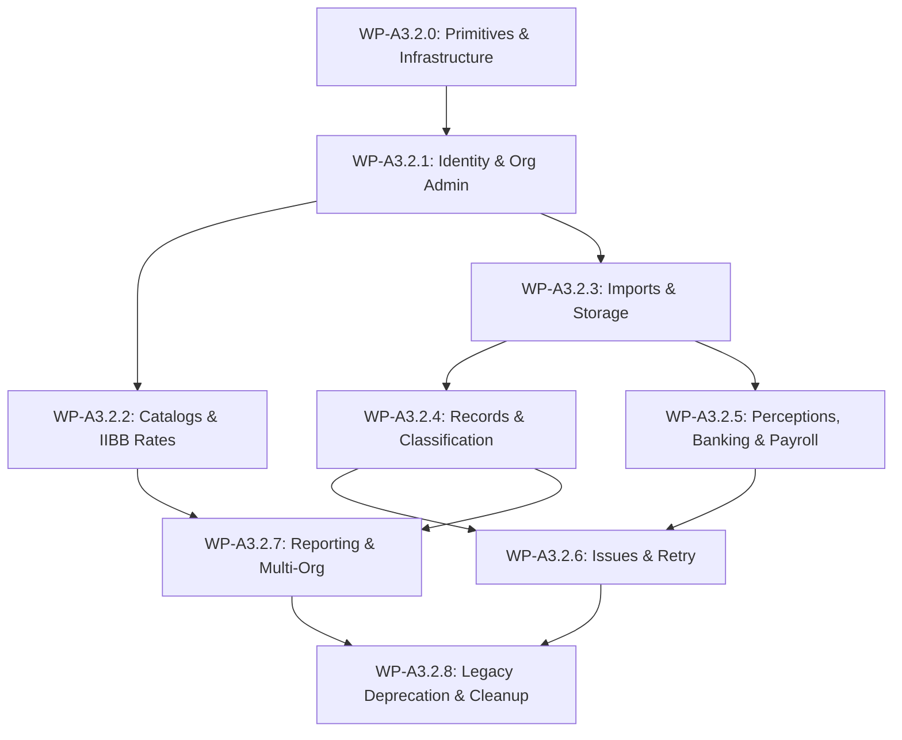

# MICA Authorization Cutover Sequence (WP-A3.1)

> **Document Status**: DISCOVERY COMPLETE & FROZEN  
> **Baseline Commit**: `7aae65c9029822d120339670b962b596bae94cd7`  
> **Architecture Principle**: Vertical / Domain-Driven Cutover (All security layers per domain migrated together).

---

## 1. Vertical Domain Rollout Strategy

Horizontal migration (e.g., migrating all RLS policies first, then all RPCs, then all frontend callers) creates massive cross-layer security risks and split-brain states.

MICA adopts a strict **Vertical Domain-Driven Cutover Sequence**. Each domain Work Package migrates **all security layers** for that specific domain in a single atomic delivery:

```
+-----------------------------------------------------------------------------------+
|                        VERTICAL DOMAIN CUTOVER SLICE                              |
+-----------------------------------------------------------------------------------+
| 1. RPC Functions & Mutation Logic                                                 |
| 2. RLS Policies (USING and WITH CHECK)                                            |
| 3. Database Triggers & Security Definer Helpers                                  |
| 4. Supabase Storage & Realtime Policies                                           |
| 5. Domain-Specific Frontend Callers & Persistence Handlers                       |
| 6. DB Behavioral Security Tests & EXPLAIN Performance Checks                      |
+-----------------------------------------------------------------------------------+
```

---

## 2. Exhaustive Vertical Cutover Sequence



---

### WP-A3.2.0: Authorization Primitives & Infrastructure
- **Observable Result**: Core capability functions (`private.can_org`, `private.can_platform`) prepared for high-concurrency production usage; caching & helper indexes verified.
- **Components Migrated**: `private.can_org`, `private.can_platform`, `private.active_org_id`, composite indexes on `eco_organization_members` and `eco_role_template_capabilities`.
- **Dependencies**: M019 capability foundation.
- **Rollback Boundary**: SQL function update rollback.
- **Required Verification**: In-database benchmark of `private.can_org` execution time (<1ms per check).

---

### WP-A3.2.1: Identity, Profiles & Organization Administration
- **Observable Result**: User role changes, status updates, and profile reads cut over to `ORG_MEMBER_PERMISSION_MANAGE` and `ORG_MEMBER_MANAGE`.
- **Components Migrated**:
  - RPCs: `public.change_user_role`, `public.set_user_active`, `public.switch_superadmin_org_context`.
  - RLS Policies: `Organizations viewable by own users`, `Profiles viewable by user and admin`, `Audit events viewable by admin`.
  - Frontend: `src/ui.js` profile management modals.
- **Dependencies**: WP-A3.2.0.
- **Rollback Boundary**: Revert RPCs to `private.func_role()` check.
- **Required Verification**: DB behavioral test proving non-admin cannot change roles; tenant admin can manage members.

---

### WP-A3.2.2: Catalogs & IIBB Rates
- **Observable Result**: Global category/activity management and tenant rate assignments cut over to `GLOBAL_CATALOG_MANAGE`, `CATALOG_ASSIGN_ANY_ORG`, `RATE_MANAGE_ANY_ORG`, and `ORG_SETTINGS_MANAGE`.
- **Components Migrated**:
  - RPCs: `create_global_tax_category`, `update_global_tax_category`, `create_global_economic_activity`, `update_global_economic_activity`, `upsert_arca_activity_catalog`, `create_org_activity_iibb_rate`, `update_org_activity_iibb_rate`, `assign_tax_category_to_org`, `unassign_tax_category_from_org`, `assign_economic_activity_to_org`, `unassign_economic_activity_from_org`.
  - RLS Policies: `Org categories viewable by org`, `Org activities viewable by org`, `Org IIBB rates viewable by org`.
  - Frontend: Catalog management & IIBB rate settings screens.
- **Dependencies**: WP-A3.2.1.
- **Rollback Boundary**: Revert catalog RPCs.

---

### WP-A3.2.3: Imports & Storage
- **Observable Result**: Source import creation, batch persistence, and Storage file uploads cut over to `IMPORT_CREATE` and `IMPORT_VIEW`.
- **Components Migrated**:
  - RPCs: `public.create_import`, `public.persist_import_batch`.
  - RLS Policies: `Imports viewable by org`, `Files viewable by org`.
  - Storage Policies: `Allow org to select its files`, `Allow org to insert its files`, `Allow org to delete its files`.
  - Frontend: `src/persistenceService.js` import dispatch routines.
- **Dependencies**: WP-A3.2.1.
- **Rollback Boundary**: Revert import RPCs and Storage bucket policies.

---

### WP-A3.2.4: Records & Classification
- **Observable Result**: Record classification, bulk update, soft deletion, and restoration cut over to `RECORD_VIEW`, `RECORD_CLASSIFY`, `RECORD_SOFT_DELETE`, `RECORD_RESTORE`.
- **Components Migrated**:
  - RPCs: `soft_delete_normalized_record`, `restore_normalized_record`, `update_record_classification`, `bulk_update_record_classification`.
  - RLS Policies: `Records viewable by org`.
  - Frontend: Categorization grid UI (`src/ui.js`).
- **Dependencies**: WP-A3.2.3.
- **Performance Requirement**: EXPLAIN ANALYZE verification on `eco_normalized_records` RLS policy to ensure zero sequential scans on high row count tables.

---

### WP-A3.2.5: Perceptions, Banking & Payroll
- **Observable Result**: Perception imports, bank statements, payroll processing, and financial movement classifications cut over to `PERCEPTION_IMPORT`, `BANK_IMPORT`, `PAYROLL_IMPORT`, `RECORD_CLASSIFY`, `RECORD_SOFT_DELETE`, `RECORD_RESTORE`.
- **Components Migrated**:
  - RPCs: `persist_perceptions_batch`, `persist_financial_movements_batch`, `soft_delete_financial_movement`, `restore_financial_movement`, `update_movement_classification`.
  - RLS Policies: `Select active financial movements by org`.
  - Frontend: Perception, bank, and salary modules.
- **Dependencies**: WP-A3.2.3.
- **Performance Requirement**: Index coverage check on `eco_financial_movements(organization_id, is_active)`.

---

### WP-A3.2.6: Issues & Retry Resolution
- **Observable Result**: Import validation issue review, resolution, and retry requests cut over to `IMPORT_REVIEW`, `ISSUE_RESOLVE`, `IMPORT_RETRY`.
- **Components Migrated**:
  - RPCs: `request_failed_import_retry`, `resolve_issue`.
  - RLS Policies: `Issues viewable by org`, `Review actions viewable by org`.
  - Frontend: Issue resolution modal.
- **Dependencies**: WP-A3.2.4, WP-A3.2.5.

---

### WP-A3.2.7: Reporting & Multi-Org Operations
- **Observable Result**: Cross-organizational reporting and multi-tenant comparative views cut over to `REPORT_VIEW`, `REPORT_EXPORT`, `REPORT_COMPARE_SCOPED_ORGS`, `REPORT_CONSOLIDATED_SCOPED_ORGS`.
- **Components Migrated**:
  - RPCs / Views: Management panel queries, comparative report handlers.
  - Frontend: Executive dashboard & report export buttons.
- **Dependencies**: WP-A3.2.4, WP-A3.2.5.

---

### WP-A3.2.8: Legacy Authorization Deprecation & Cleanup
- **Observable Result**: Complete deprecation of legacy helpers `private.func_role()` and `private.org_id()`; legacy fields `eco_user_profiles.role` locked/archived.
- **Components Migrated**: Private schema function cleanup, removal of legacy fallback code paths.
- **Dependencies**: All prior WP-A3.2.x WPs complete and validated in DEV.
