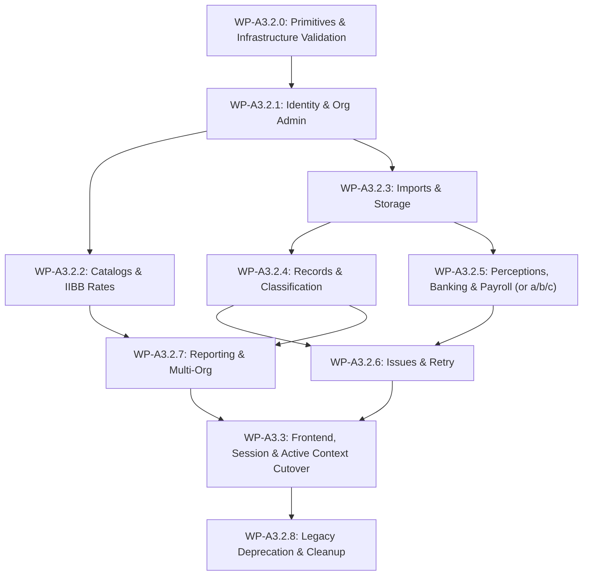

# MICA Authorization Cutover Sequence (WP-A3.1)

> **Document Status**: DISCOVERY COMPLETE & FROZEN  
> **Baseline Commit**: `7aae65c9029822d120339670b962b596bae94cd7`  
> **Architecture Principle**: Vertical / Domain-Driven Cutover (All security layers per domain migrated together).

---

## 1. Vertical Domain Rollout Strategy

Horizontal migration (e.g., migrating all RLS policies first, then all RPCs, then all frontend callers) creates massive cross-layer security risks, split-brain states, and untestable intermediate conditions.

MICA adopts a strict **Vertical Domain-Driven Cutover Sequence**. Every domain Work Package must migrate **all security layers and dependencies for that specific domain together as an atomic unit**:

```
+-----------------------------------------------------------------------------------+
|                        ATOMIC VERTICAL DOMAIN CUTOVER SLICE                       |
+-----------------------------------------------------------------------------------+
| 1. RPC Functions & Mutation Logic (SECURITY DEFINER auth checks)                  |
| 2. Database Table RLS Policies (USING and WITH CHECK migrated together)          |
| 3. Database Triggers & Auth-Sensitive Helper Functions                           |
| 4. Supabase Storage Bucket & Realtime Policies (if applicable)                    |
| 5. Domain-Specific Frontend Callers & Persistence Handlers                       |
| 6. Domain-Specific Negative Security & Isolation Behavioral Tests                |
| 7. Domain-Specific Rollback Boundary Verification                                 |
| 8. Query Plan & Performance Baseline Verification                                |
+-----------------------------------------------------------------------------------+
```

> [!IMPORTANT]
> **No Deferred RLS Convergence**: RLS policy migration must **NEVER** be left as a later horizontal phase. For example, when cutting over the `IMPORTS` domain, `create_import`, `persist_import_batch`, `eco_source_imports` RLS, `eco_source_files` RLS, storage policies on `eco-imports-private-staging`, and `persistenceService` callers all migrate and verify in the same atomic Work Package.

---

## 2. Exhaustive Vertical Cutover Sequence



---

### WP-A3.2.0: Authorization Primitives & Infrastructure Validation
- **Objective**: **PROVE AUTHORIZATION PRIMITIVES ARE SAFE AND SUFFICIENT FOR DOMAIN CUTOVER** before modifying any business-domain authorization logic.
- **Strict Scope Boundary**:
  - Validates `private.can_org`, `private.can_platform`, `private.active_org_id`, and composite indexing on `eco_organization_members` and `eco_role_template_capabilities`.
  - Must **NOT** become a broad optimization refactor, general schema cleanup, frontend change, or domain cutover.
- **Dependencies**: M019 capability foundation.
- **Rollback Boundary**: SQL function updates revert to initial M019 definitions.
- **Required Verification**: `PERFORMANCE_BASELINE_REQUIRED_BEFORE_CUTOVER` — Establish execution plan and latency baseline via `EXPLAIN`, `EXPLAIN ANALYZE` (where safe), index verification, representative benchmarks, and before/after comparison.

---

### WP-A3.2.1: Identity, Profiles & Organization Administration
- **Observable Result**: User role changes, status updates, and profile reads cut over to `ORG_MEMBER_PERMISSION_MANAGE` and `ORG_MEMBER_MANAGE`.
- **Components Migrated**:
  - RPCs: `public.change_user_role`, `public.set_user_active`, `public.switch_superadmin_org_context`.
  - RLS Policies: `Organizations viewable by own users`, `Profiles viewable by user and admin`, `Audit events viewable by admin`.
  - Frontend: `src/ui.js` profile management modals.
- **Dependencies**: WP-A3.2.0.
- **Rollback Boundary**: Revert RPCs and RLS to `private.func_role()` and `private.org_id()` checks.
- **Required Verification**: DB behavioral test proving non-admin cannot change roles; tenant admin can manage members.

---

### WP-A3.2.2: Catalogs & IIBB Rates
- **Observable Result**: Global category/activity management and tenant rate assignments cut over to `GLOBAL_CATALOG_MANAGE`, `CATALOG_ASSIGN_ANY_ORG`, `RATE_MANAGE_ANY_ORG`, and `ORG_SETTINGS_MANAGE`.
- **Components Migrated**:
  - RPCs: `create_global_tax_category`, `update_global_tax_category`, `create_global_economic_activity`, `update_global_economic_activity`, `upsert_arca_activity_catalog`, `create_org_activity_iibb_rate`, `update_org_activity_iibb_rate`, `assign_tax_category_to_org`, `unassign_tax_category_from_org`, `assign_economic_activity_to_org`, `unassign_economic_activity_from_org`.
  - RLS Policies: `Org categories viewable by org`, `Org activities viewable by org`, `Org IIBB rates viewable by org`.
  - Frontend: Catalog management & IIBB rate settings screens.
- **Dependencies**: WP-A3.2.1.
- **Rollback Boundary**: Revert catalog RPCs and policies.

---

### WP-A3.2.3: Imports & Storage
- **Observable Result**: Source import creation, batch persistence, and Storage file uploads cut over to `IMPORT_CREATE` and `IMPORT_VIEW`.
- **Components Migrated**:
  - RPCs: `public.create_import`, `public.persist_import_batch`.
  - RLS Policies: `Imports viewable by org`, `Files viewable by org`.
  - Storage Policies: `Allow org to select its files`, `Allow org to insert its files`, `Allow org to delete its files`.
  - Frontend: `src/persistenceService.js` import dispatch routines.
- **Dependencies**: WP-A3.2.1.
- **Rollback Boundary**: Revert import RPCs and Storage bucket policies.

---

### WP-A3.2.4: Records & Classification
- **Observable Result**: Record classification, bulk update, soft deletion, and restoration cut over to `RECORD_VIEW`, `RECORD_CLASSIFY`, `RECORD_SOFT_DELETE`, `RECORD_RESTORE`.
- **Components Migrated**:
  - RPCs: `soft_delete_normalized_record`, `restore_normalized_record`, `update_record_classification`, `bulk_update_record_classification`.
  - RLS Policies: `Records viewable by org`.
  - Frontend: Categorization grid UI (`src/ui.js`).
- **Dependencies**: WP-A3.2.3.
- **Performance Requirement**: `PERFORMANCE_BASELINE_REQUIRED_BEFORE_CUTOVER` — EXPLAIN ANALYZE verification on `eco_normalized_records` RLS policy to ensure index-backed evaluation.

---

### WP-A3.2.5: Perceptions, Banking & Payroll (Decomposition Option)
- **Observable Result**: Perception imports, bank statements, payroll processing, and financial movement classifications cut over to `PERCEPTION_IMPORT`, `BANK_IMPORT`, `PAYROLL_IMPORT`, `RECORD_CLASSIFY`, `RECORD_SOFT_DELETE`, `RECORD_RESTORE`.
- **Decomposition Option**:
  To maintain minimal vertical slices and independent rollback boundaries, WP-A3.2.5 may be decomposed into:
  - **WP-A3.2.5a**: `PERCEPTIONS` (`persist_perceptions_batch`, perceptions RLS, UI)
  - **WP-A3.2.5b**: `BANKING` (`persist_financial_movements_batch` for banks, bank movements RLS, UI)
  - **WP-A3.2.5c**: `PAYROLL` (`persist_financial_movements_batch` for salaries, payroll RLS, UI)
  *Decision will be finalized during A3.2.5 design based on dependency graph isolation.*
- **Components Migrated**:
  - RPCs: `persist_perceptions_batch`, `persist_financial_movements_batch`, `soft_delete_financial_movement`, `restore_financial_movement`, `update_movement_classification`.
  - RLS Policies: `Select active financial movements by org`.
  - Frontend: Perception, bank, and salary modules.
- **Dependencies**: WP-A3.2.3.

---

### WP-A3.2.6: Issues & Retry Resolution
- **Observable Result**: Import validation issue review, resolution, and retry requests cut over to `IMPORT_REVIEW`, `ISSUE_RESOLVE`, `IMPORT_RETRY`.
- **Components Migrated**:
  - RPCs: `request_failed_import_retry`, `resolve_issue`.
  - RLS Policies: `Issues viewable by org`, `Review actions viewable by org`.
  - Frontend: Issue resolution modal.
- **Dependencies**: WP-A3.2.4, WP-A3.2.5.

---

### WP-A3.2.7: Reporting & Multi-Org Operations
- **Observable Result**: Cross-organizational reporting and multi-tenant comparative views cut over to `REPORT_VIEW`, `REPORT_EXPORT`, `REPORT_COMPARE_SCOPED_ORGS`, `REPORT_CONSOLIDATED_SCOPED_ORGS`.
- **Components Migrated**:
  - RPCs / Views: Management panel queries, comparative report handlers.
  - Frontend: Executive dashboard & report export buttons.
- **Dependencies**: WP-A3.2.4, WP-A3.2.5.

---

### WP-A3.2.8: Legacy Authorization Deprecation & Cleanup
- **Observable Result**: Complete removal of legacy helpers `private.func_role()` and `private.org_id()`; legacy fields `eco_user_profiles.role` locked/archived.
- **Explicit Sequence Dependency**: **`A3.2.8 DEPENDS ON WP-A3.3`**.
  A3.2.8 may execute **ONLY** after:
  1. All server domain cutovers (WP-A3.2.1 through WP-A3.2.7) are CLOSED and verified.
  2. WP-A3.3 (Frontend, Session, and Active Context Cutover) is CLOSED and verified in DEV.
- **Reason**: The frontend client codebase continues to depend on legacy assumptions (`profile.role`, `profile.organization_id`, active organization/session behavior, UI authorization conditions, tenant state rehydration) throughout WP-A3.2. Legacy helpers and fields cannot be deprecated or dropped while these frontend dependencies remain active.
- **Components Migrated**: Private schema function cleanup, removal of legacy fallback code paths.
